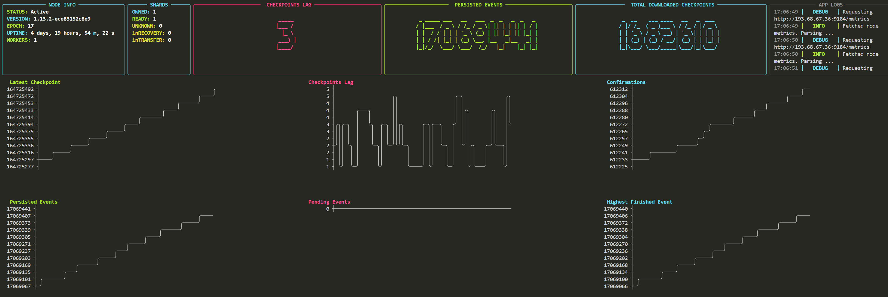

### **Rich-Walrus** is a command-line application that monitors critical storage metrics and provides a real-time visualization via the terminal. It tracks various storage health indicators, including metrics like checkpoint lag, event processing, and shard status, and displays them in an interactive dashboard format. The tool helps keep track of storage node health, offering visual feedback on performance metrics directly in the CLI.

#### Readmap:
- Add support for monitoring aggregator and publisher nodes.
- Implement background stress tests to evaluate node performance under load.
- Improve real-time visualization and monitoring for storage, aggregator, and publisher nodes.

---
[]()
---
### 1. Update and install required packages
```bash
sudo apt update && sudo apt install python3 python3-venv git -y
```
### 2. Clone the repository
```bash
git clone https://github.com/trusted-point/Rich-Walrus.git
cd Rich-Walrus
```
### 3. Activate virtual environment (Optional)
```bash
python3 -m venv venv
source venv/bin/activate
# deactivate - to deactivate virtual environment
```
### 4. Install dependencies
```bash
pip3 install -r requirements.txt
```
### 5. Start the app
```bash
python3 main.py --storage-metrics-url http://walrus-testnet-storage.trusted-point.com:9184/metrics --storage-rpc-url https://walrus-testnet-storage.trusted-point.com:9185
```
### Flags and parameters
```bash
-h, --help            show this help message and exit
--logs-lvl LOGS_LVL   Set the logging level [DEBUG, INFO, WARNING, ERROR] (default: DEBUG)
--logs-path LOGS_PATH
                    Path to the log file. If not provided, logs will not be stored (default: None)
--dashboard-refresh-per-second DASHBOARD_REFRESH_PER_SECOND
                    Refresh rate of the table per second (default: 5)
--dashboard-graph-size DASHBOARD_GRAPH_SIZE
                    Edit size of graphs in case they are borken due too small screen size (default: 50)
--storage-metrics-url STORAGE_METRICS_URL
                    Storage node prometheus metrics url (default: http://127.0.0.1:9184/metrics)
--storage-rpc-url STORAGE_RPC_URL
                    Storage node RPC metrics url (default: http://127.0.0.1:9185)
--storage-refresh-metrics-rate STORAGE_REFRESH_METRICS_RATE
                    Refresh metrics every N second (default: 2)
--storage-refresh-rpc-rate STORAGE_REFRESH_RPC_RATE
                    Refresh rpc status every N second (/v1/health) (default: 20)
```